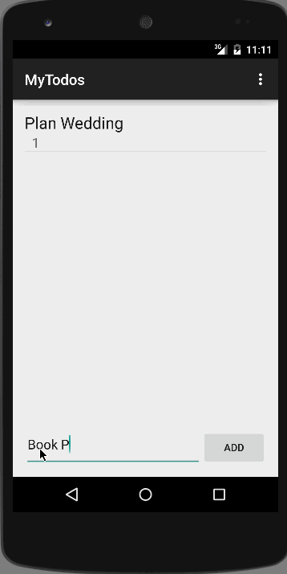

# An Android ToDo App
A bare bones, simple todo app to stream line your life.  Followed CodePath's Android Pre-work [instructions](http://courses.codepath.com/snippets/intro_to_android/prework).

## Basic Functionality

Completed user stories:

 - [x] Add and remove items from the todo list within your app
 - [x] Include ability to edit todo items
 - [x] Persist todo items and retrieve them properly on app restart
 - [x] Persist the todo items into SQLite instead of a text file

GIF created with [LiceCap](http://www.cockos.com/licecap/)

## Notes

Next items to work on:
 - [ ] Improve style of the todo items in the list using a custom adapter
 - [ ] Add support for completion due dates for todo items and display within listview item
 - [ ] Use a DialogFragment instead of new Activity for editing items

